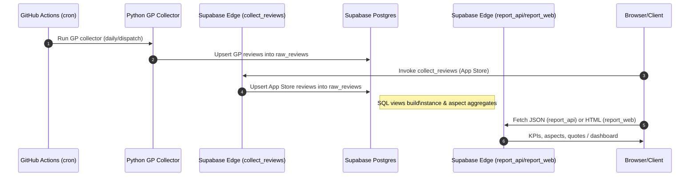

# Credit Builder Feedback Miner (PH)

A small, production-lean pipeline to collect public user feedback about a Tonik-like credit builder feature from app stores, normalize and aggregate in Supabase, and publish a minimal dashboard and JSON API.

## What it does
- Collects App Store reviews (PH) via a Supabase Edge Function (`collect_reviews`, RSS-based)
- Collects Google Play reviews via GitHub Actions (Python scraper)
- Stores raw events in `public.raw_reviews`
- Provides SQL views for stance and aspects (`v_kpis`, `v_aspect_sentiment`, `v_aspect_quotes`)
- Exposes:
  - JSON API: `report_api`
  - Public HTML dashboard: `report_web`

## Quick links
- Dashboard (public): https://edoxpbhrcyetfpuadxdo.functions.supabase.co/report_web
- JSON API (POST): https://edoxpbhrcyetfpuadxdo.functions.supabase.co/report_api
- Supabase Studio: https://supabase.com/dashboard/project/edoxpbhrcyetfpuadxdo

## Architecture sequence (Mermaid)

## Data model
- `public.raw_reviews` (table)
  - source: `google_play | app_store`
  - platform_app_id, review_id, author_hash, rating, title, content, posted_at, thumbs_up, data (jsonb)
- `public.v_feedback`, `public.v_feedback_canonical` (views)
  - Cleaned text, dedupe, stance from rating
- `public.aspects` (table)
  - Aspect → keyword array
- `public.v_aspect_hits`, `public.v_aspect_sentiment`, `public.v_aspect_quotes`, `public.v_kpis` (views)

## Running the collectors
- App Store (Edge): POST https://edoxpbhrcyetfpuadxdo.functions.supabase.co/collect_reviews
- Google Play (GH Actions): Actions → “Collect Reviews” → Run
  - Requires repo secrets: `SUPABASE_URL`, `SERVICE_ROLE_KEY`

## Configuration
- Supabase secrets for Edge Functions:
  - `PROJECT_URL` = your Supabase project URL
  - `SERVICE_ROLE_KEY` = service role key (stored as function secret)
- GitHub Actions (file: `.github/workflows/reviews.yml`):
  - `GP_APP_ID` (default `com.tonik.mobile`)
  - `GP_MAX_REVIEWS` (increase for deeper backfill)

## Limitations
- App Store: RSS feed pagination is limited; older reviews may require multiple pages and are subject to platform availability
- Google Play: The library may be rate/region constrained; deeper backfills need multiple scheduled runs
- Sentiment: Stance is inferred from star ratings by design (no ML Sentiment yet)
- Aspect detection: keyword-based; can be tuned/extended

## Future improvements
- ML sentiment (multilingual transformer) and aspect modeling (BERTopic)
- Additional sources (Reddit, YouTube) via new collectors that upsert into the same schema
- Streamlit or Metabase visualization

## References
- Google Play (Tonik): https://play.google.com/store/apps/details?id=com.tonik.mobile&hl=en&pli=1
- App Store (Tonik PH): https://apps.apple.com/ph/app/tonik-loans-deposits/id1541576007

## Local development
- Supabase CLI installed; project linked to `edoxpbhrcyetfpuadxdo`
- Edge Functions are in `supabase/functions/*`
- DB migrations in `supabase/migrations/*`
